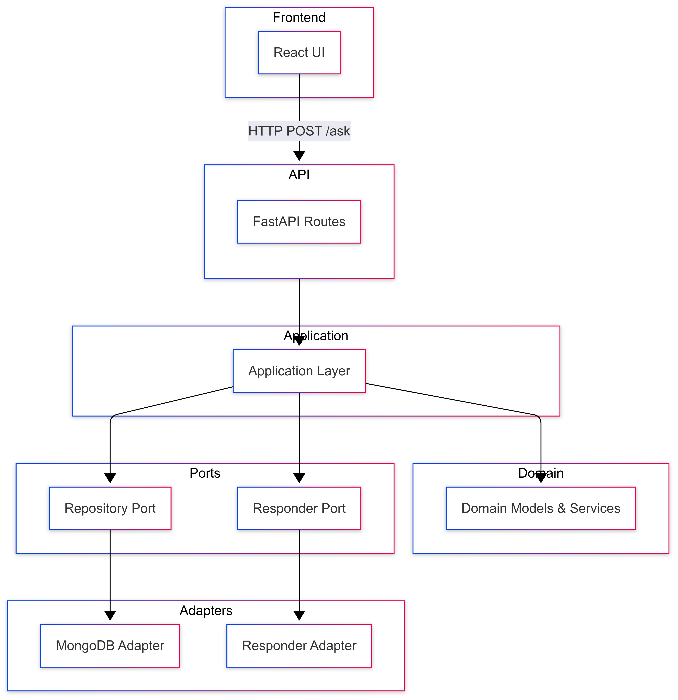
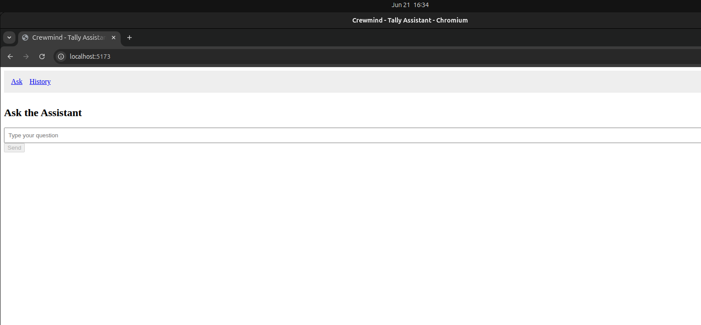
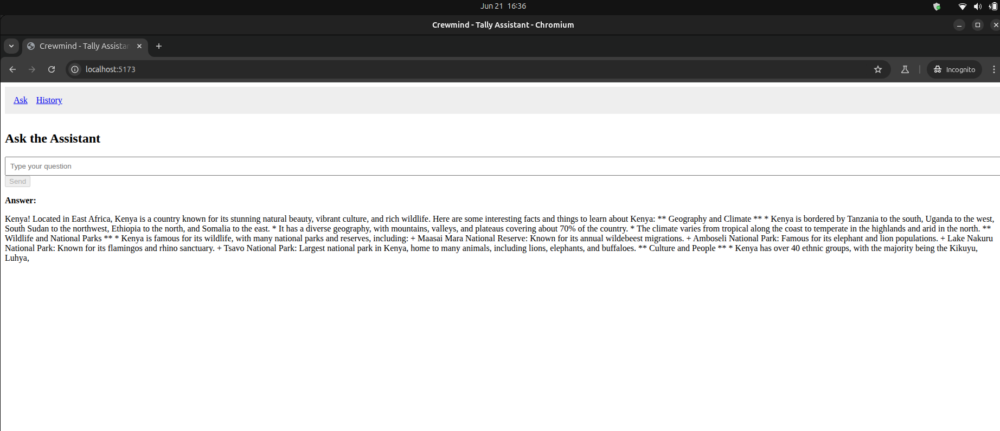
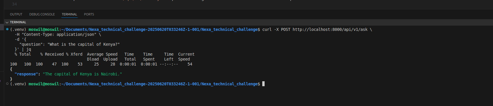
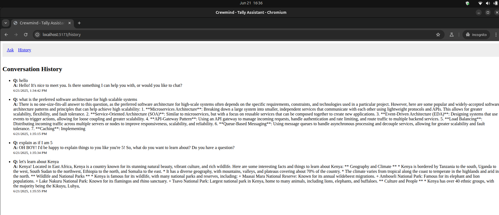
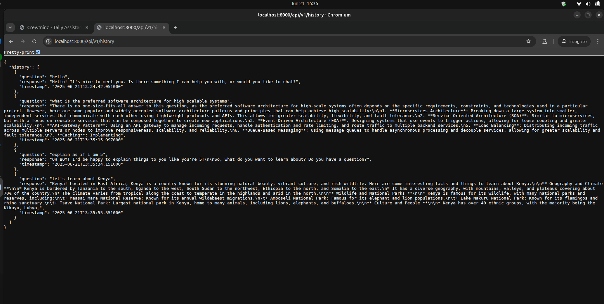

# Crewmind - Tally AI Assistant

## 🧠 System Architecture

The system follows a modular hexagonal architecture. The React frontend communicates with a FastAPI backend through clearly defined ports and adapters. MongoDB stores question-response pairs, and an external LLM (e.g., Together.ai) handles dynamic responses.

---

## 💻 Application Screenshots

### 🗨️ Ask Assistant Page

*Above: The main interface where users can submit questions and receive responses in real-time.*

*Above: A screenshot of the `POST /api/v1/ask` request via a test client showing the assistant’s response.*

---

### 🕓 History Page

*Above: Displays the full conversation history with past questions and AI responses.*

*Above: Raw JSON response from the `GET /api/v1/history` endpoint showing stored conversations with timestamps.*
